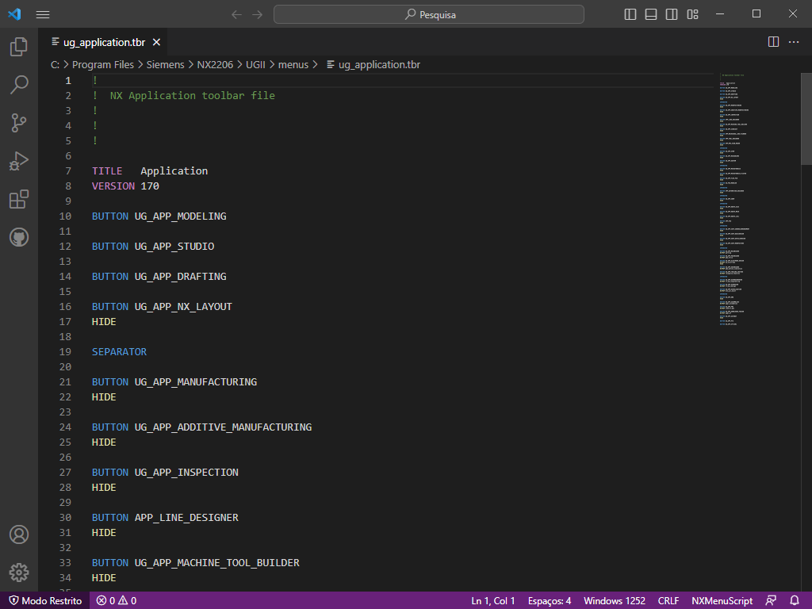
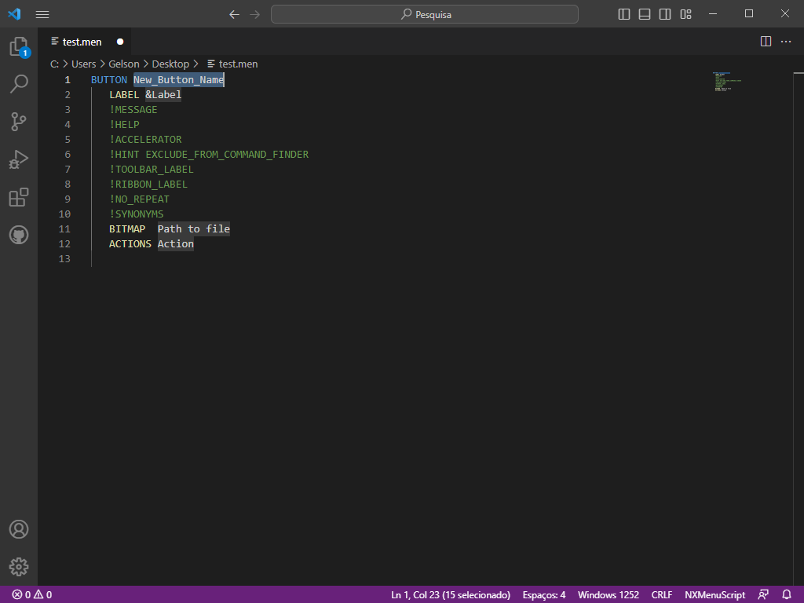

# NX-Menu-Script 

This extension aims to help developers customize MenuScript language files used in the Siemens NX CAD system with color enhancements

## Features

Menu Script file extension supported:
* abr
* btn
* dat
* gly
* grb
* men
* rtb
* tbr

Keywords with colors

You can use .men snippets to create custom ribon bars, buttons, actions, etc.

## Requirements

* To start using your extension with Visual Studio Code copy it into the `<user home>/.vscode/extensions` folder and restart Code.

## Known Issues

This extension is not intended for advanced features like autocompletion or format checking.

## Release Notes

### 1.0.0

First Release

## For more information

**Enjoy!**
